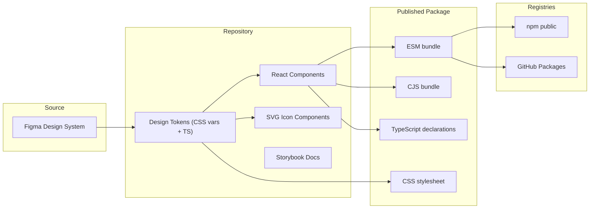

# Meraki Design System — Figma to GitHub Package

## Architecture Overview




---

## Phase 1 — Project Scaffolding

Initialize the repo and install core tooling.

- **Init repo**: `git init`, create `package.json` with name `@meraki-ds/react` (or your preferred scope)
- **TypeScript**: `tsconfig.json` targeting ESNext, React JSX transform
- **Build tool**: [tsup](https://tsup.egoist.dev/) — generates CJS, ESM, `.d.ts`, and handles CSS
- **Dev tooling**: ESLint, Prettier, Husky + lint-staged for pre-commit hooks
- **Storybook**: `@storybook/react-vite` for component docs and visual testing

### Target directory structure

```
meraki-ds/
├── .github/
│   └── workflows/
│       ├── ci.yml              # lint + test + build on PR
│       └── publish.yml         # publish on release tag
├── .storybook/
│   └── main.ts
├── src/
│   ├── tokens/
│   │   ├── colors.ts
│   │   ├── spacing.ts
│   │   ├── typography.ts
│   │   ├── shadows.ts
│   │   ├── index.ts            # barrel export for TS token values
│   │   └── tokens.css          # CSS custom properties
│   ├── icons/
│   │   ├── svg/                # raw SVGs from Figma
│   │   ├── Icon.tsx            # base icon component
│   │   ├── ArrowRight.tsx      # generated icon components
│   │   └── index.ts
│   ├── components/
│   │   ├── Button/
│   │   │   ├── Button.tsx
│   │   │   ├── Button.css
│   │   │   ├── Button.stories.tsx
│   │   │   └── index.ts
│   │   ├── Input/
│   │   │   └── ...
│   │   └── index.ts
│   └── index.ts                # root barrel export
├── scripts/
│   └── generate-icons.ts       # SVG → React component generator
├── package.json
├── tsconfig.json
├── tsup.config.ts
├── .npmrc
├── LICENSE
└── README.md
```

---

## Phase 2 — Extract Design Tokens from Figma

When the Figma URL is provided, use the **Figma MCP** (`get_design_context`) to pull the design system structure. From that, extract:

- **Colors** — primitives (palette) and semantic aliases (e.g. `--color-primary`, `--color-surface`)
- **Spacing** — scale (4, 8, 12, 16, 24, 32, 48, 64...)
- **Typography** — font families, sizes, weights, line heights
- **Shadows** — elevation levels
- **Border radii** — small, medium, large, full
- **Breakpoints** — if defined

Tokens will be authored in two formats:

1. `**tokens.css`** — CSS custom properties for runtime use:

```css
   :root {
     --color-primary: #6366f1;
     --spacing-md: 16px;
     --font-size-body: 1rem;
   }
   

```

1. **TypeScript constants** — for type-safe access in JS/TS:

```typescript
   export const colors = {
     primary: 'var(--color-primary)',
     secondary: 'var(--color-secondary)',
   } as const;
   

```

---

## Phase 3 — Build Icon Pipeline

- Export SVGs from Figma (or pull via API)
- Create a `scripts/generate-icons.ts` script using [SVGR](https://react-svgr.com/) to convert each SVG into a typed React component
- Each icon component accepts standard `SVGProps<SVGSVGElement>` plus a `size` prop
- Barrel-export all icons from `src/icons/index.ts`

---

## Phase 4 — Implement Core Components

Build components using React + CSS custom properties. Each component follows this pattern:

- `**ComponentName.tsx**` — functional component with `forwardRef`, typed props interface
- `**ComponentName.css**` — styles using design tokens via `var(--token-name)`
- `**ComponentName.stories.tsx**` — Storybook stories with controls
- `**index.ts**` — re-exports component and props type

Initial component set (adapt based on what's in your Figma file):

- Button (primary, secondary, ghost, destructive variants; sizes sm/md/lg)
- Input / TextField
- Select
- Checkbox / Radio
- Card
- Badge
- Avatar
- Modal / Dialog
- Toast / Alert
- Tooltip

All components will:

- Use `forwardRef` for ref forwarding
- Accept a `className` prop for consumer overrides
- Use `data-*` attributes for variant styling (e.g. `data-variant="primary"`)
- Ship with TypeScript prop types exported alongside the component

---

## Phase 5 — Build Configuration

`tsup.config.ts`:

- **Entry points**: `src/index.ts` (main), `src/tokens/index.ts` (tokens sub-path), `src/icons/index.ts` (icons sub-path)
- **Formats**: ESM + CJS
- **Declarations**: `dts: true`
- **External**: `react`, `react-dom` (peer deps)
- **CSS**: Inject `tokens.css` into the build output

`package.json` exports map:

```json
{
  "exports": {
    ".": { "import": "./dist/index.js", "require": "./dist/index.cjs", "types": "./dist/index.d.ts" },
    "./tokens": { "import": "./dist/tokens/index.js", "require": "./dist/tokens/index.cjs", "types": "./dist/tokens/index.d.ts" },
    "./icons": { "import": "./dist/icons/index.js", "require": "./dist/icons/index.cjs", "types": "./dist/icons/index.d.ts" },
    "./css": "./dist/tokens.css"
  }
}
```

This allows consumers to do:

```typescript
import { Button } from '@meraki-ds/react';
import { colors } from '@meraki-ds/react/tokens';
import { ArrowRight } from '@meraki-ds/react/icons';
import '@meraki-ds/react/css';
```

---

## Phase 6 — Storybook Documentation

- Configure `@storybook/react-vite`
- Add a **Tokens** docs page showing the full color palette, spacing scale, and typography
- Each component gets stories with interactive controls via `argTypes`
- Deploy Storybook to **GitHub Pages** via CI (optional but recommended)

---

## Phase 7 — CI/CD and Publishing

### GitHub Actions — CI (`.github/workflows/ci.yml`)

- Trigger: pull requests
- Steps: install, lint, type-check, build, run Storybook smoke test

### GitHub Actions — Publish (`.github/workflows/publish.yml`)

- Trigger: GitHub Release created (or manual dispatch)
- Steps: install, build, publish to **both** npm and GitHub Packages
- Uses `NPM_TOKEN` secret for npm, `GITHUB_TOKEN` for GitHub Packages

### Versioning

- Use **[Changesets](https://github.com/changesets/changesets)** for automated versioning and changelogs
- Each PR that changes the package includes a changeset file describing the change
- On merge to main, a "Version Packages" PR is auto-created; merging it triggers a release

---

## Phase 8 — README and Consumer Docs

- Installation instructions for both registries
- Quick-start code example
- Link to Storybook for full docs
- Token customization guide (overriding CSS custom properties)

---

## Suggested Order of Execution

The phases above are roughly sequential, but some can overlap. The recommended build order is:

1. Scaffolding (Phase 1) — get the project skeleton running
2. Tokens (Phase 2) — foundational; everything else depends on these
3. Icons (Phase 3) — independent of components, can run in parallel with Phase 4
4. Components (Phase 4) — the bulk of the work
5. Build config (Phase 5) — verify the package builds and exports correctly
6. Storybook (Phase 6) — can start alongside Phase 4 (story per component)
7. CI/CD (Phase 7) — set up once the build is stable
8. Docs + first publish (Phase 8)

